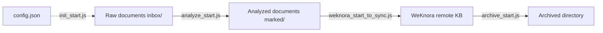

# Knowledge Pipeline

Core skill for knowledge base pipeline, providing four main functions: initialization, document analysis, sync to WeKnora, and file archiving.

## Features

| Function | Script | Description |
|----------|--------|-------------|
| init | `init_start.js` | Initialize directory structure and `.config/config.json` |
| analyze | `analyze_start.js` | Metadata extraction + 5-dimension rating + merge frontmatter |
| sync | `weknora_start_to_sync.js` | Import final documents to WeKnora (direct to normal/wiki KB) |
| archive | `archive_start.js` | Archive old files by age |

## Directory Structure

```
${profile}/
├── .config/
│   ├── config.json              ← Main configuration file
│   ├── prompts/                 ← Custom prompts (optional)
│   │   ├── meta.json
│   │   └── rate.json
│   └── schema/                  ← Custom data schemas (optional)
│       ├── meta.json
│       └── rate.json
├── inbox/                       ← Raw documents
├── marked/                      ← Analyzed documents
├── weknora/                     ← Synced documents
└── archived/                    ← Archived documents
```

## Flow Diagram



## Quick Start

### Initialize

```bash
node scripts/init_start.js <base_dir>
```

### Document Analysis

```bash
node scripts/analyze_start.js <source_dir> <target_dir> [batch_size]
```

### Sync to WeKnora

```bash
node scripts/weknora_start_to_sync.js <source_dir> <target_dir> <config.json>
```

### Archive

```bash
node scripts/archive_start.js <source_dir> <target_dir> [days]
```

## Sync to WeKnora (sync)

Imports documents from `marked/` **one by one** directly into the target We knowledge base (normal or wiki KB), **without using a temporary KB**. The temporary KB approach causes vector loss after move, making documents unsearchable in the target KB. Direct upload allows WeKnora to parse and generate summaries in the target KB.

### Per-Article Workflow

1. Read file, parse frontmatter, select target KB by `score` (if `wiki_kb_id` configured and `score ≥ score_threshold` → wiki, else normal)
2. Upload to target KB: `POST /knowledge-bases/{target}/knowledge/manual` (title only, no hash)
3. Poll until parsing completes
4. `PUT /knowledge/{id}`: write only `custom_metadata` (including `hash`), **no description** (summary generated by WeKnora)
5. Assign tags
6. Move local file to `weknora/`
7. Wait `normal_submit_interval_ms` or `wiki_submit_interval_ms` based on target KB type

### Weknora Configuration Fields

Key fields in `config.json`'s `weknora` section:

| Field | Required | Description |
|-------|----------|-------------|
| `kb_id` | ✅ | Normal KB ID |
| `wiki_kb_id` | ❌ | Wiki KB ID (enables score-based routing) |
| `score_threshold` | ❌ | Score threshold (score ≥ threshold → wiki) |
| `concurrency` | ❌ | Concurrent workers (default 1, serial) |
| `normal_submit_interval_ms` | ❌ | Wait interval for normal KB uploads (default 30000) |
| `wiki_submit_interval_ms` | ❌ | Wait interval for wiki KB uploads (default 600000) |
| `custom_metas` | ✅ | Field mapping for WeKnora custom_metadata |

> Compatibility: When `normal_submit_interval_ms` / `wiki_submit_interval_ms` are not configured, both fall back to `submit_interval_ms` (or 100ms if also not configured). Default intervals (30s / 600s) are estimated based on summary generation time and can be tuned per hardware.

### Error Handling

| Scenario | Handling |
|----------|----------|
| Single article upload/parse failure | Log FAIL, continue processing others |
| PUT failure | Log META, article still imported successfully |
| Tag assignment failure | Throw, local file **not moved**, reprocessed on next run |
| Slow summary generation | Mitigated by wait intervals, tunable in config |

## Environment Variables

### Profile Configuration

| Variable | Default | Description |
|----------|---------|-------------|
| `KB_BASE_PATH` | - | Knowledge base root directory (e.g., `D:\knowledge\obsidian`) |
| `KB_DEFAULT_PROFILE` | - | Default profile name (e.g., `ai`), combined with `KB_BASE_PATH` to form full path |

Profile path resolution: `${KB_BASE_PATH}/${KB_DEFAULT_PROFILE}` (e.g., `D:\knowledge\obsidian\ai`)

### Analysis

| Variable | Default | Description |
|----------|---------|-------------|
| `KB_LLM_BASE_URL` | `http://localhost:11434/v1` | LLM API address |
| `KB_LLM_API_KEY` | empty | LLM API key |
| `KB_LLM_MODEL` | `qwen2.5:3b` | Default model |
| `KB_LLM_META_MODEL` | inherits `KB_LLM_MODEL` | Metadata extraction model |
| `KB_LLM_RATE_MODEL` | inherits `KB_LLM_MODEL` | Rating extraction model |
| `KB_LLM_TIMEOUT_MS` | `120000` | LLM request timeout (ms) |
| `KB_LLM_PROVIDER` | `auto` | Backend type: `auto`/`ollama`/`openai` |

### Sync

| Variable | Default | Description |
|----------|---------|-------------|
| `PB_KNOWLEDGE_BASE_PATH` | required | Knowledge base root directory |
| `WEKNORA_BASE_URL` | required | WeKnora API base URL |
| `WEKNORA_API_KEY` | required | API key |

## Custom Prompts & Schemas

Place files in `${profile}/.config/prompts/` and `${profile}/.config/schema/` to override defaults:

| Optional File | Purpose |
|---------------|---------|
| `.config/prompts/meta.json` | Override metadata extraction prompts |
| `.config/prompts/rate.json` | Override rating extraction prompts |
| `.config/schema/meta.json` | Override metadata JSON Schema |
| `.config/schema/rate.json` | Override rating JSON Schema |

Default files are in `skills/knowledge/prompts/` and `skills/knowledge/schemas/`.

## LLM Backend Configuration

The LLM client (`scripts/lib/llm.js`) supports two backend types:

- **Ollama native API (`provider=ollama`)**: Uses `/api/chat` endpoint with `think:false` to disable reasoning mode. Recommended for Ollama backends.
- **OpenAI-compatible (`provider=openai`)**: Uses `/v1/chat/completions` endpoint.

### Important Notes

- **Qwen 3.5 models**: Default thinking mode returns empty `content` field. Use `provider=ollama` to enable `think:false` parameter.
- **Provider detection**: When `provider=auto`, auto-detects by URL (checks for `11434` or `ollama` in URL). For custom ports, set `provider=ollama` explicitly.

### Switching Examples

**Default - Local Ollama**

```bash
KB_LLM_PROVIDER=ollama
KB_LLM_BASE_URL=http://localhost:11434/v1
KB_LLM_MODEL=qwen3.5:4b
```

**OpenAI / Azure / Tongyi / DeepSeek etc.**

```bash
KB_LLM_PROVIDER=openai
KB_LLM_BASE_URL=https://<your-provider>/v1
KB_LLM_MODEL=gpt-4o-mini
KB_LLM_API_KEY=<your-api-key>
```

## Script Structure

```
scripts/
├── init_start.js            ← Initialization
├── analyze_start.js         ← Analysis main entry
├── analyze_extract_meta.js  ← Metadata extraction module
├── analyze_extract_rate.js  ← Rating extraction module
├── analyze_frontmatter.js   ← YAML frontmatter generation
├── weknora_start_to_sync.js ← WeKnora sync
├── archive_start.js         ← Archiving
└── lib/
    ├── llm.js               ← LLM client
    ├── common.js            ← Utility functions (includes getProfileDir)
    ├── content_hash.js      ← Content hash
    └── validate_md.js       ← Markdown format validation
```

### Profile Path Resolution

The `getProfileDir()` function in `lib/common.js` resolves the profile directory:

```javascript
function getProfileDir() {
    const basePath = process.env.KB_BASE_PATH;
    const defaultProfile = process.env.KB_DEFAULT_PROFILE;
    if (basePath && defaultProfile) {
        return path.join(basePath, defaultProfile);
    }
    return defaultProfile || null;
}
```

Usage in scripts: If command-line arguments are not provided, scripts use `getProfileDir()` to resolve default paths (e.g., `${profileDir}/inbox`, `${profileDir}/marked`).

## Caching & Idempotency

- `.meta.json` exists → skip metadata extraction
- `.rate.json` exists → skip rating
- Both cache files exist → skip extraction, merge directly
- Final filename `${title}.md`: **no longer contains hash**; hash is only in frontmatter's `hash` field and WeKnora's `custom_metadata.hash`
- Duplicate name strategy: if same name exists, same hash → overwrite; different hash → append number `${title}(1).md`, `${title}(2).md` ...
- Sync side **no longer does hash deduplication** or **temporary KB周转**: articles upload directly to target KB, summaries generated by WeKnora; duplicate detection left for future SQL queries on WeKnora KB
