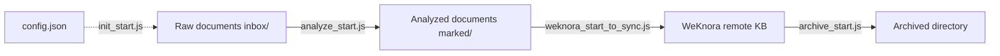

# Knowledge Pipeline

Core skill for knowledge base pipeline, providing four main functions: initialization, document analysis, sync to WeKnora, and file archiving.

## Features

| Function | Script | Description |
|----------|--------|-------------|
| init | `init_start.js` | Initialize directory structure and `$config/config.json` |
| analyze | `analyze_start.js` | Metadata extraction + 5-dimension rating + merge frontmatter |
| sync | `weknora_start_to_sync.js` | Import final documents to WeKnora (direct to normal/wiki KB) |
| sync:forge | `weknora_forge_start_to_sync.js` | Same sync flow via WeKnora Forge (signed HMAC + one-shot publish) |
| archive | `archive_start.js` | Archive old files by age |

## Directory Structure

```
${profile}/
├── $config/
│   ├── config.json              ← Main configuration file
│   ├── extractor_meta_config.json   ← Optional: overrides the meta plugin config
│   └── extractor_rate_config.json   ← Optional: overrides the rate plugin config
├── inbox/                       ← Raw documents
├── marked/                      ← Analyzed documents
├── weknora/                     ← Synced documents
└── archived/                    ← Archived documents
```

## Flow Diagram



## Quick Start

### Initialize

```bash
node scripts/init_start.js <base_dir>
```

### Document Analysis

```bash
node scripts/analyze_start.js <source_dir> <target_dir> [batch_size]
```

### Sync to WeKnora

```bash
node scripts/weknora_start_to_sync.js <source_dir> <target_dir> <config.json>
```

### Sync via WeKnora Forge

```bash
npm run sync:forge
# or
node --env-file=.env scripts/weknora_forge_start_to_sync.js [profile]
```

Requires env `WEKNORA_FORGE_BASE_URL` (plus `WEKNORA_API_KEY` / `WEKNORA_API_SECRET`, or profile `weknora.api_key` / `weknora.api_secret`). See [Sync via WeKnora Forge](#sync-via-weknora-forge-syncforge).

### Archive

```bash
node scripts/archive_start.js <source_dir> <target_dir> [days]
```

## Sync to WeKnora (sync)

Imports documents from `marked/` **one by one** directly into the target We knowledge base (normal or wiki KB), **without using a temporary KB**. The temporary KB approach causes vector loss after move, making documents unsearchable in the target KB. Direct upload allows WeKnora to parse and generate summaries in the target KB.

### Per-Article Workflow

1. Read file, parse frontmatter, select target KB by `score` (if `wiki_kb_id` configured and `score ≥ score_threshold` → wiki, else normal)
2. Dedup check (optional) and assign tags
3. **Create as draft**: `POST /knowledge-bases/{target}/knowledge/manual` with `status=draft`, carrying `tag_ids` in the same request
4. **Write metadata**: `PUT /knowledge/{id}` writes only `custom_metadata` (including `hash`), then reads the record back to verify
5. **Publish**: `PUT /knowledge/manual/{id}` with `status=publish` — this is what starts the parse pipeline
6. Move local file to `weknora/`, only after all three calls succeed; failures leave it in place for the next run
7. Wait `normal_submit_interval_ms` or `wiki_submit_interval_ms` so WeKnora has time to generate the summary

### Why "Draft → Metadata → Publish"

WeKnora's create payload (`ManualKnowledgePayload`) has **no `custom_metadata` field at all**, so metas can only be written after creation. Creating directly with `publish` starts the parse pipeline immediately, and that pipeline writes the whole row back from an in-memory snapshot — clobbering any `custom_metadata` PUT that succeeded moments earlier. Draft mode removes the race entirely:

| Stage | Pipeline state | Metadata write |
|-------|----------------|----------------|
| `status=draft` | Never enters the pipeline (`parse_status=draft`, `enable_status=disabled`) | No concurrent writer exists, so the write is guaranteed to stick |
| `PUT /knowledge/{id}` | Same | `summary_status` is still empty, so **no summary is regenerated** — zero extra LLM cost |
| `status=publish` | Parsing and summary generation begin | Metas are already stored, so the first summary is generated with them |

Tags are unaffected: `POST .../manual` writes `tag_ids` into the `knowledge_tags` join table at creation time, while the publish endpoint reads only title / content / status / process_config and never touches that table — no stage of the pipeline writes it either.

The cost is two extra HTTP requests per article, in exchange for no race and no extra LLM calls.

### Weknora Configuration Fields

Key fields in `config.json`'s `weknora` section:

| Field | Required | Description |
|-------|----------|-------------|
| `kb_id` | ✅ | Normal KB ID |
| `wiki_kb_id` | ❌ | Wiki KB ID (enables score-based routing) |
| `score_threshold` | ❌ | Score threshold (score ≥ threshold → wiki) |
| `concurrency` | ❌ | Concurrent workers (default 1, serial) |
| `normal_submit_interval_ms` | ❌ | Wait interval for normal KB uploads (default 30000) |
| `wiki_submit_interval_ms` | ❌ | Wait interval for wiki KB uploads (default 600000) |
| `submit_interval_ms` | ❌ | Fallback wait interval after publishing |
| `batch_size` | ❌ | Max articles per run (0 = all) |
| `dedup_enabled` | ❌ | Legacy script only: enable title + hash dedup (`sync:forge` ignores this and always dedups when `hash` is present) |
| `custom_metas` | ✅ | Field mapping for WeKnora custom_metadata |
| `max_consecutive_failures` | ❌ | Consecutive failures before aborting the run (default 3) |
| `abort_grace_ms` | ❌ | Grace period for in-flight requests after abort, then kills the process (default 30000) |
| `rollback_on_publish_failure` | ❌ | Delete the leftover draft when publishing fails (default true) |

> Compatibility: When `normal_submit_interval_ms` / `wiki_submit_interval_ms` are not configured, both fall back to `submit_interval_ms` (or 100ms if also not configured). Default intervals (30s / 600s) are estimated based on summary generation time and can be tuned per hardware.

### Error Handling

| Scenario | Handling |
|----------|----------|
| Publish failure | Rolls back the leftover draft by default (`rollback_on_publish_failure`); a draft left behind would later be treated as already-processed by dedup and skipped forever. Local file is not moved |
| Duplicate without custom_metadata | Treated as a husk from an abandoned upload (metadata is written before publishing, so a missing hash means it never finished) — **deleted**, then uploaded as if nothing existed |
| Any other per-article failure | Log FAIL, local file is not moved, retried on the next run |
| Consecutive failures | After `max_consecutive_failures` (default 3), stop taking new work and **exit the process with a non-zero code**. Remaining articles stay in the source directory |
| Tag assignment failure | Throw, local file **not moved**, reprocessed on next run |
| Slow summary generation | Mitigated by wait intervals, tunable in config |

## Sync via WeKnora Forge (sync:forge)

`scripts/weknora_forge_start_to_sync.js` performs the same profile/config/KB-routing/dedup/move flow as `weknora_start_to_sync.js`, but talks to **WeKnora Forge** instead of the raw WeKnora HTTP API. The original script is unchanged.

### Call

```bash
npm run sync:forge [profile]
```

### Environment variables

| Variable | Required | Description |
|----------|----------|-------------|
| `KB_BASE_PATH` / `KB_DEFAULT_PROFILE` | ❌ | Profile root (else pass `<profile>` on the CLI) |
| `WEKNORA_FORGE_BASE_URL` | ✅ | Forge base URL |
| `WEKNORA_API_KEY` | ✅* | `X-API-Key` (*profile `weknora.api_key` wins if set) |
| `WEKNORA_API_SECRET` | ✅* | HMAC-SHA256 signing secret (*profile `weknora.api_secret` wins if set) |

Signature: `X-Forge-Signature = hex(HMAC_SHA256(api_secret, METHOD + FULL_PATH))` where `FULL_PATH` includes the raw query string (no normalization).

### Auth / config resolution

1. Profile `$config/config.json` → `weknora.api_key` / `weknora.api_secret`
2. Else env `WEKNORA_API_KEY` / `WEKNORA_API_SECRET`

`WEKNORA_FORGE_BASE_URL` is always read from the environment.

### Per-article publish

One Forge call replaces draft → metadata → publish:

`POST .../knowledge/publish` with `{kb_id, title, content, description?, tag_names, custom_metas, sync}`.

`sync` comes from config `publish_sync` (default `false`): when true the backend indexes immediately instead of waiting on the async pipeline. Tags are resolved server-side; failures roll back server-side.

### Dedup (forge)

Dedup always runs when the file has a frontmatter `hash` (no config switch):

1. Search **only** `custom_metadata.hash = '<hash>'` across normal + wiki KBs (`title` is not part of the query).
2. Compare `item.title === submitTitle` against each hit (`submitTitle` = frontmatter `title`, else filename without `.md`).
3. Any hit with the same title → `DUP`, move to `marked/dupl/`. Hash present but titles differ (or no hits) → publish as usual.

### Extra config fields

| Field | Default | Description |
|-------|---------|-------------|
| `publish_sync` | `false` | Publish payload `sync` flag (immediate index) |
| `api_key` / `api_secret` | `""` | Forge credentials (override env when set) |

## Environment Variables

### Profile Configuration

| Variable | Default | Description |
|----------|---------|-------------|
| `KB_BASE_PATH` | - | Knowledge base root directory (e.g., `D:\knowledge\obsidian`) |
| `KB_DEFAULT_PROFILE` | - | Default profile name (e.g., `ai`), combined with `KB_BASE_PATH` to form full path |

Profile path resolution: `${KB_BASE_PATH}/${KB_DEFAULT_PROFILE}` (e.g., `D:\knowledge\obsidian\ai`)

### Analysis

| Variable | Default | Description |
|----------|---------|-------------|
| `KB_LLM_BASE_URL` | `http://localhost:11434` | LLM API address |
| `KB_LLM_API_KEY` | empty | LLM API key |
| `KB_LLM_MODEL` | `qwen2.5:3b` | Default model |
| `KB_LLM_META_MODEL` | inherits `KB_LLM_MODEL` | Metadata extraction model |
| `KB_LLM_RATE_MODEL` | inherits `KB_LLM_MODEL` | Rating extraction model |
| `KB_LLM_TIMEOUT_MS` | `120000` | LLM request timeout (ms) |
| `KB_LLM_PROVIDER` | `auto` | Backend type: `auto`/`ollama`/`openai` |

### Sync

| Variable | Default | Description |
|----------|---------|-------------|
| `PB_KNOWLEDGE_BASE_PATH` | required | Knowledge base root directory |
| `WEKNORA_BASE_URL` | required | WeKnora API base URL |
| `WEKNORA_API_KEY` | required | API key |
| `WEKNORA_FORGE_BASE_URL` | required for `sync:forge` | WeKnora Forge base URL |
| `WEKNORA_API_SECRET` | required for `sync:forge`* | Forge HMAC secret (`weknora.api_secret` takes priority) |

\* `sync:forge` also needs `WEKNORA_API_KEY` / profile `api_key` as above.

## Plugin Configs (Prompts & Schemas)

Each plugin keeps its prompt and schema in **one** config file next to the plugin:

```
scripts/plugins/
├── extractor_meta.js              ← plugin implementation
├── extractor_meta_config.json     ← prompt + schema
├── extractor_rate.js
└── extractor_rate_config.json
```

File shape:

```json
{
  "prompt": { "system": "...", "user": "... {{content}}", "retry": "..." },
  "schema": { "title": ["string", 1], "tags": ["array", 2, 5] }
}
```

To override the defaults, drop a same-named file into the profile's `$config/`
— no entry in `config.json` is needed:

```
${profile}/$config/extractor_meta_config.json    ← used if present, else the built-in one
```

The file name is fixed as `<plugin-name>_config.json`. An override replaces the
default entirely — include both `prompt` and `schema`.

## LLM Backend Configuration

The LLM client (`scripts/lib/llm.js`) supports two backend types:

- **Ollama native API (`provider=ollama`)**: Uses `/api/chat` endpoint with `think:false` to disable reasoning mode. Recommended for Ollama backends.
- **OpenAI-compatible (`provider=openai`)**: Uses `/v1/chat/completions` endpoint.

### Important Notes

- **Qwen 3.5 models**: Default thinking mode returns empty `content` field. Use `provider=ollama` to enable `think:false` parameter.
- **Provider detection**: When `provider=auto`, auto-detects by URL (checks for `11434` or `ollama` in URL). For custom ports, set `provider=ollama` explicitly.

### Switching Examples

**Default - Local Ollama**

```bash
KB_LLM_PROVIDER=ollama
KB_LLM_BASE_URL=http://localhost:11434
KB_LLM_MODEL=qwen3.5:4b
```

**OpenAI / Azure / Tongyi / DeepSeek etc.**

```bash
KB_LLM_PROVIDER=openai
KB_LLM_BASE_URL=https://<your-provider>/v1
KB_LLM_MODEL=gpt-4o-mini
KB_LLM_API_KEY=<your-api-key>
```

## Script Structure

```
scripts/
├── init_start.js            ← Initialization
├── analyze_start.js         ← Analysis main entry
├── analyze_extract_meta.js  ← Metadata extraction module
├── analyze_extract_rate.js  ← Rating extraction module
├── analyze_frontmatter.js   ← YAML frontmatter generation
├── weknora_start_to_sync.js ← WeKnora sync
├── weknora_forge_start_to_sync.js ← WeKnora Forge sync
├── archive_start.js         ← Archiving
└── lib/
    ├── llm.js               ← LLM client
    ├── common.js            ← Utility functions (includes getProfileDir)
    ├── weknora.js           ← WeKnora HTTP client
    ├── weknora_forge.js     ← WeKnora Forge client (HMAC + search + publish)
    ├── content_hash.js      ← Content hash
    └── validate_md.js       ← Markdown format validation
```

### Profile Path Resolution

The `getProfileDir()` function in `lib/common.js` resolves the profile directory:

```javascript
function getProfileDir() {
    const basePath = process.env.KB_BASE_PATH;
    const defaultProfile = process.env.KB_DEFAULT_PROFILE;
    if (basePath && defaultProfile) {
        return path.join(basePath, defaultProfile);
    }
    return defaultProfile || null;
}
```

Usage in scripts: If command-line arguments are not provided, scripts use `getProfileDir()` to resolve default paths (e.g., `${profileDir}/inbox`, `${profileDir}/marked`).

## Caching & Idempotency

- `.meta.json` exists → skip metadata extraction
- `.rate.json` exists → skip rating
- Both cache files exist → skip extraction, merge directly
- Final filename `${title}.md`: **no longer contains hash**; hash is only in frontmatter's `hash` field and WeKnora's `custom_metadata.hash`
- Duplicate name strategy: if same name exists, same hash → overwrite; different hash → append number `${title}(1).md`, `${title}(2).md` ...
- Sync side **no longer does hash deduplication** or **temporary KB周转**: articles upload directly to target KB, summaries generated by WeKnora; duplicate detection left for future SQL queries on WeKnora KB
- **Exception — `sync:forge`:** when frontmatter has `hash`, always query remote KBs by `hash` only, then mark `DUP` only if a hit’s `title` exactly equals the submit title (see [Sync via WeKnora Forge](#sync-via-weknora-forge-syncforge))
