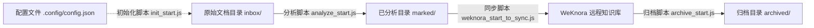

# 知识库管线 (knowledge)

知识库管线的核心技能，提供四大功能：初始化、文档分析、同步导入 WeKnora、归档旧文件。

## 功能一览

| 功能 | 脚本 | 说明 |
|------|------|------|
| init | `init_start.js` | 初始化目录结构和 `.config/config.json` |
| analyze | `analyze_start.js` | 元数据提取 + 五维评分 + 合并 frontmatter |
| sync | `weknora_start_to_sync.js` | 将终稿导入 WeKnora（直传普通库 / wiki 库） |
| archive | `archive_start.js` | 按文件年龄归档旧文件 |

## 目录结构

```
${profile}/
├── .config/
│   ├── config.json              ← 主配置文件
│   ├── extractor_meta_config.json   ← 可选：覆盖 meta 插件配置
│   └── extractor_rate_config.json   ← 可选：覆盖 rate 插件配置
├── inbox/                       ← 原始文档
├── marked/                      ← 已分析文档
├── weknora/                     ← 已同步文档
└── archived/                    ← 归档文档
```

## 整体流程图



## 快速开始

### 初始化

```bash
node skills/knowledge/scripts/init_start.js <base_dir>
```

### 文档分析

```bash
node scripts/kb-analyze.js <profile> [batch_size]
```

### 同步到 WeKnora

```bash
node scripts/kb-weknora.js <profile>
```

### 归档

```bash
node scripts/kb-archive.js <profile> [days]
```

## 同步导入 WeKnora (sync)

将 `marked/` 中的终稿**逐篇**直接导入 WeKnora 的目标知识库（普通库或 wiki 库），**不再经临时库周转**。临时库方案下 move 后向量不跟随，会导致目标库文章无法检索；直传后 WeKnora 直接在目标库内解析并生成摘要。

### 每篇文章流程

1. 读文件、解析 frontmatter，按 `score` 选择目标库（`wiki_kb_id` 已配且 `score ≥ score_threshold` → wiki，否则普通库）
2. 直接上传到目标库：`POST /knowledge-bases/{target}/knowledge/manual`（标题 `title`，不含 hash）
3. 轮询解析完成
4. `PUT /knowledge/{id}`：仅写入 `custom_metadata`（含 `hash`），**不传 description**（摘要完全由 WeKnora 生成，避免覆盖）
5. 分配 tags
6. 移动本地文件到 `weknora/`
7. 按目标库类型等待 `normal_submit_interval_ms` / `wiki_submit_interval_ms`，确保 WeKnora 有足够时间生成摘要，再处理下一篇

### weknora 配置字段

`config.json` 的 `weknora` 节关键字段：

| 字段 | 必填 | 说明 |
|------|------|------|
| `kb_id` | ✅ | 普通库知识库 ID |
| `wiki_kb_id` | ❌ | wiki 知识库 ID（配了才启用评分分流） |
| `score_threshold` | ❌ | 评分阈值（score ≥ 阈值 → wiki） |
| `concurrency` | ❌ | 并发路数（默认 1，串行） |
| `normal_submit_interval_ms` | ❌ | 普通库每篇上传后等待间隔（默认 30000） |
| `wiki_submit_interval_ms` | ❌ | wiki 库每篇上传后等待间隔（默认 600000） |
| `custom_metas` | ✅ | 写入 WeKnora custom_metadata 的字段映射 |

> 兼容性：未配置 `normal_submit_interval_ms` / `wiki_submit_interval_ms` 时，两者均回退到旧字段 `submit_interval_ms`（若也未配则 100ms）。两个间隔默认值（30s / 600s）是按摘要生成耗时估算的，可随硬件升级调整。

### 错误处理

| 场景 | 处理 |
|------|------|
| 单篇上传/解析失败 | 记录 FAIL，继续处理其他篇 |
| PUT 失败 | 记录 META，文章仍导入成功 |
| 分配 tags 失败 | 抛出，该篇本地文件**不移动**，下次运行重新处理（可能在 WeKnora 产生重复） |
| 摘要生成较慢 | 通过等待间隔缓解，间隔可在 config 中调优 |

## 环境变量

### Profile 配置

| 变量 | 默认值 | 说明 |
|------|--------|------|
| `KB_BASE_PATH` | - | 知识库根目录（如 `D:\knowledge\obsidian`） |
| `KB_DEFAULT_PROFILE` | - | 默认 profile 名称（如 `ai`），与 `KB_BASE_PATH` 拼接成完整路径 |

Profile 路径解析：`${KB_BASE_PATH}/${KB_DEFAULT_PROFILE}`（如 `D:\knowledge\obsidian\ai`）

### 分析功能

| 变量 | 默认值 | 说明 |
|------|--------|------|
| `KB_LLM_BASE_URL` | `http://localhost:11434/v1` | LLM API 地址 |
| `KB_LLM_API_KEY` | 空 | LLM API 密钥 |
| `KB_LLM_MODEL` | `qwen2.5:3b` | 默认模型 |
| `KB_LLM_META_MODEL` | 继承 `KB_LLM_MODEL` | 元数据提取专用模型 |
| `KB_LLM_RATE_MODEL` | 继承 `KB_LLM_MODEL` | 评分提取专用模型 |
| `KB_LLM_TIMEOUT_MS` | `120000` | 单次 LLM 请求超时 |
| `KB_LLM_PROVIDER` | `auto` | 后端类型：`auto`/`ollama`/`openai` |

### 同步功能

| 变量 | 默认值 | 说明 |
|------|--------|------|
| `PB_KNOWLEDGE_BASE_PATH` | 必填 | 知识库根目录 |
| `WEKNORA_BASE_URL` | 必填 | WeKnora API 地址 |
| `WEKNORA_API_KEY` | 必填 | API 密钥 |

## 插件配置（提示词 + 数据结构）

每个插件的提示词与数据结构合并为**一个**配置文件，默认随插件放在 `scripts/plugins/`：

```
scripts/plugins/
├── extractor_meta.js              ← 插件实现
├── extractor_meta_config.json     ← prompt + schema
├── extractor_rate.js
└── extractor_rate_config.json
```

文件结构：

```json
{
  "prompt": { "system": "...", "user": "... {{content}}", "retry": "..." },
  "schema": { "title": ["string", 1], "tags": ["array", 2, 5] }
}
```

要覆盖默认配置，在 profile 的 `.config/` 下放一个**同名**文件即可，无需在 `config.json` 里声明：

```
${profile}/.config/extractor_meta_config.json    ← 存在则覆盖，否则用插件目录默认文件
```

文件名固定为 `<插件名>_config.json`。覆盖文件为**整体替换**，需包含完整的 `prompt` 与 `schema` 两段。

## 跨厂商配置（LLM 后端）

LLM 客户端（`scripts/lib/llm.js`）支持两种后端类型：

- **Ollama native API（`provider=ollama`）**：使用 `/api/chat` 端点，通过 `think:false` 禁用推理模式。推荐用于 Ollama 后端。
- **OpenAI 兼容（`provider=openai`）**：使用 `/v1/chat/completions` 端点。

### 重要说明

- **Qwen 3.5 模型**：默认开启思考模式，返回的 `content` 字段为空。使用 `provider=ollama` 可启用 `think:false` 参数。
- **Provider 检测**：当 `provider=auto` 时，通过 URL 自动检测（检查 URL 中是否包含 `11434` 或 `ollama`）。对于自定义端口，需显式设置 `provider=ollama`。

### 切换示例

**默认——本地 Ollama**

```bash
KB_LLM_PROVIDER=ollama
KB_LLM_BASE_URL=http://localhost:11434/v1
KB_LLM_MODEL=qwen3.5:4b
```

**对接 OpenAI / Azure / 通义 / DeepSeek 等**

```bash
KB_LLM_PROVIDER=openai
KB_LLM_BASE_URL=https://<your-provider>/v1
KB_LLM_MODEL=gpt-4o-mini
KB_LLM_API_KEY=<your-api-key>
```

## 脚本结构

```
scripts/
├── init_start.js            ← 初始化
├── analyze_start.js         ← 分析主入口
├── analyze_extract_meta.js  ← 元数据提取模块
├── analyze_extract_rate.js  ← 评分提取模块
├── analyze_frontmatter.js   ← YAML frontmatter 生成
├── weknora_start_to_sync.js ← 同步 WeKnora
├── archive_start.js         ← 归档
└── lib/
    ├── llm.js               ← LLM 客户端
    ├── common.js            ← 通用工具函数（含 getProfileDir）
    ├── content_hash.js      ← 内容 hash
    └── validate_md.js       ← Markdown 格式校验
```

### Profile 路径解析

`lib/common.js` 中的 `getProfileDir()` 函数用于解析 profile 目录：

```javascript
function getProfileDir() {
    const basePath = process.env.KB_BASE_PATH;
    const defaultProfile = process.env.KB_DEFAULT_PROFILE;
    if (basePath && defaultProfile) {
        return path.join(basePath, defaultProfile);
    }
    return defaultProfile || null;
}
```

脚本中的用法：如果未提供命令行参数，脚本使用 `getProfileDir()` 解析默认路径（如 `${profileDir}/inbox`、`${profileDir}/marked`）。

## 缓存与幂等

- `.meta.json` 已存在 → 跳过元数据提取
- `.rate.json` 已存在 → 跳过评分
- 两个缓存文件都存在 → 跳过提取，直接合并
- 终稿文件名 `${title}.md`：**不再包含 hash**；hash 仅写入 frontmatter 的 `hash` 字段与 WeKnora 的 `custom_metadata.hash`
- 同名文件策略：已存在同名文件时，若 `hash` 相同则直接覆盖，不同则追加序号 `${title}(1).md`、`${title}(2).md` …
- 同步侧**不再做 hash 去重**，**不再经临时库周转**：文章直接上传到目标库（普通库或 wiki 库），摘要由 WeKnora 直接生成；重复检测留待后续通过 SQL 检索 WeKnora 知识库
