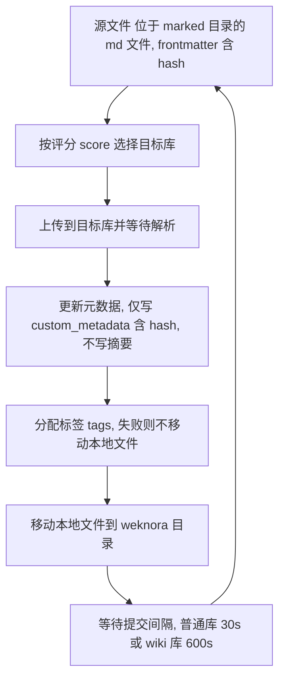

---
name: knowledge
description: "知识库管线技能：初始化目录、文档分析（元数据提取+评分+合并）、同步导入 WeKnora、归档旧文件。通过不同命令选择功能。"
---

# 知识库管线 (knowledge)

知识库管线的核心技能，提供四大功能：

| 功能 | 脚本 | 说明 |
|------|------|------|
| **init** | `init_start.js` | 初始化目录结构和 `.config/config.json` |
| **analyze** | `analyze_start.js` | 元数据提取 + 五维评分 + 合并 frontmatter |
| **sync** | `weknora_start_to_sync.js` | 将终稿导入 WeKnora 远程知识库 |
| **archive** | `archive_start.js` | 按文件年龄归档旧文件 |

> 本技能为**纯脚本驱动**，不依赖 LLM Agent。调用方通过不同命令选择功能。

---

## 目录结构

```
${profile}/
├── .config/
│   ├── config.json              ← 主配置文件
│   ├── prompts/                 ← 自定义提示词（可选）
│   │   ├── meta.json            ← 覆盖元数据提取提示词
│   │   └── rate.json            ← 覆盖评分提取提示词
│   └── schema/                  ← 自定义数据结构（可选）
│       ├── meta.json            ← 覆盖元数据 JSON Schema
│       └── rate.json            ← 覆盖评分 JSON Schema
├── inbox/                       ← 原始文档
├── marked/                      ← 已分析文档
├── weknora/                     ← 已同步文档
└── archive/                     ← 归档文档
```

---

## 功能一：初始化 (init)

创建知识库 profile 根目录下的目录结构和默认 `.config/config.json`。幂等操作——已存在的目录/文件不会被覆盖。

### 调用方式

```bash
node skills/knowledge/scripts/init_start.js <base_dir>
```

| 参数 | 必填 | 说明 |
|------|------|------|
| `<base_dir>` | 是 | 知识库 profile 根目录（如 `D:/knowledge/obsidian/ai`） |

### 默认 config.json

```json
{
  "weknora": {
    "source_folder": "marked",
    "target_folder": "weknora",
    "kb_id": "",
    "wiki_kb_id": "",
    "score_threshold": 3.5,
    "concurrency": 1,
    "normal_submit_interval_ms": 30000,
    "wiki_submit_interval_ms": 600000,
    "sync_enabled": true,
    "custom_metas": {
      "source": "$source",
      "author": "$auther",
      "aliases": "$aliases",
      "score": "$score",
      "channel": "wechat-mp"
    }
  },
  "archive": { "days": 90 },
  "analyze": { "batch_size": 30 }
}
```

---

## 功能二：文档分析 (analyze)

对源目录内的 `.md` 文章批量执行 **元数据提取 + 五维评分 + 合并 frontmatter**，终稿移动到目标目录。

### 调用方式

```bash
node skills/knowledge/scripts/analyze_start.js <source_dir> <target_dir> [batch_size]
```

| 参数 | 必填 | 说明 |
|------|------|------|
| `<source_dir>` | 是 | 源文章目录（如 `inbox/`） |
| `<target_dir>` | 是 | 终稿输出目录（如 `marked/`） |
| `[batch_size]` | 否 | 批处理文件数上限，默认 30 |

### 环境变量

| 变量 | 必填 | 默认值 | 说明 |
|------|------|--------|------|
| `KB_LLM_BASE_URL` | 否 | `http://localhost:11434/v1` | LLM API 地址（OpenAI 兼容） |
| `KB_LLM_API_KEY` | 否 | 空 | LLM API 密钥（Ollama 可留空） |
| `KB_LLM_MODEL` | 否 | `qwen2.5:3b` | 默认模型（meta 和 rate 共用） |
| `KB_LLM_META_MODEL` | 否 | 继承 `KB_LLM_MODEL` | 元数据提取专用模型（覆盖默认） |
| `KB_LLM_RATE_MODEL` | 否 | 继承 `KB_LLM_MODEL` | 评分提取专用模型（覆盖默认） |
| `KB_LLM_TIMEOUT_MS` | 否 | `120000` | 单次 LLM 请求超时（毫秒） |

### 自定义提示词与数据结构

在 `${profile}/.config/prompts/` 和 `${profile}/.config/schema/` 中放置同名文件可覆盖默认配置：

| 可选文件 | 作用 |
|---------|------|
| `.config/prompts/meta.json` | 覆盖元数据提取提示词（system/user/retry） |
| `.config/prompts/rate.json` | 覆盖评分提取提示词（system/user/retry） |
| `.config/schema/meta.json` | 覆盖元数据 JSON Schema |
| `.config/schema/rate.json` | 覆盖评分 JSON Schema |

未配置时自动使用 `skills/knowledge/prompts/` 和 `skills/knowledge/schemas/` 中的默认文件。

### 脚本架构

```
analyze_start.js                 ← Main entry: orchestrates full pipeline
├── lib/llm.js                   ← LLM client + utility functions
├── lib/content_hash.js          ← Content hash (3 rounds sha256, 12 hex)
├── analyze_extract_meta.js      ← Metadata extraction (in-process module)
├── analyze_extract_rate.js      ← Rating extraction (in-process module)
└── analyze_frontmatter.js       ← YAML frontmatter generation (in-process module)
```

### 处理流程

```
source_dir/*.md
  │
  ▼  Step 1: Strip existing frontmatter + clean content
  │
  ▼  Step 2: Compute content hash (3 rounds sha256, 12 hex)
  │
  ├──→ Step 3 & 4: Extract metadata + Rate content (parallel)
  │         ├──→ ${hash}.meta.json
  │         └──→ ${hash}.rate.json
  │
  ▼  Step 5: Generate YAML header
  │
   ▼  Step 6: Create target file → target_dir/${title}.md（同名按 hash 覆盖或加序号）
  │
  ▼  Step 7: Cleanup intermediate files
  │
  done
```

### 元数据标准

每篇产出 `.meta.json`：

```json
{
  "title": "MoE架构：稀疏激活与大模型容量",
  "date": "2026-07-31T10:30:00+08:00",
  "auther": "科技兽",
  "source": "原始文件名.md",
  "tags": ["大模型", "开源", "MoE"],
  "summary": "MoE架构通过稀疏激活在同等算力下实现更大模型容量。",
  "keywords": "MoE, 稀疏激活",
  "aliases": ["Mixture of Experts", "混合专家"],
  "model": "qwen2.5:3b"
}
```

| 字段 | 类型 | 必填 | 提取规则 |
|------|------|------|---------|
| `title` | string | 是 | 从 frontmatter 提取，回退正文首部标题 |
| `date` | string | 是 | **打标时刻**（ISO 8601 含时区），非文章发布时间 |
| `auther` | string | 否 | 从正文检索作者/公众号名；无则 `""` |
| `source` | string | 否 | 原始文档的文件名 |
| `tags` | string[] | 是 | 2-5 个标签，精准概括主题 |
| `summary` | string | 是 | 1-2 句核心摘要（80-150字） |
| `keywords` | string | 是 | 2-5 个关键词，逗号分隔 |
| `aliases` | string[] | 是 | 标题核心实体的别名（缩写/简称/同义术语/英文译名） |
| `model` | string | 是 | Ollama 模型名称 |

### 评分标准

每篇产出 `.rate.json`：

```json
{
  "ratings": { "value": 4, "tech": 5, "public": 3, "academic": 2, "ethics": 5 },
  "score": 3.8,
  "model": "qwen2.5:3b"
}
```

| 维度 | 含义 | 评分范围 |
|------|------|---------|
| `value` | 商业与市场价值 | 1-10 |
| `tech` | 技术创新与工程实现 | 1-10 |
| `public` | 公众传播与社会影响力 | 1-10 |
| `academic` | 学术研究价值 | 1-10 |
| `ethics` | 伦理合规与社会责任 | 1-10 |

`score` 由脚本自动计算（五维平均值，保留一位小数），不由大模型产出。

### 缓存与幂等

- `${hash}.meta.json` 已存在 → 跳过元数据提取
- `${hash}.rate.json` 已存在 → 跳过评分
- 两个缓存文件都存在 → 跳过提取，直接合并
- 终稿文件名 `${title}.md`：**不再包含 hash**；hash 仅写入 frontmatter 与 WeKnora 的 `custom_metadata.hash`
- 同名策略：已存在同名文件时，hash 相同则覆盖，不同则追加序号 `${title}(1).md`

---

## 功能三：同步导入 WeKnora (sync)

将 `{source}` 目录中带 frontmatter 的终稿**逐篇**直接导入 WeKnora 的目标知识库（普通库或 wiki 库），**不再经临时库周转**，以便 WeKnora 直接为目标库内的文章生成摘要（临时库 move 后向量不跟随，会导致目标库无法检索）。

### 调用方式

```bash
node scripts/kb-weknora.js <profile>
```

| 参数 | 必填 | 说明 |
|------|------|------|
| `<profile>` | 是 | 知识库 profile 名称（如 `ai`） |

### 环境变量

| 变量 | 必填 | 默认值 | 说明 |
|------|------|--------|------|
| `PB_KNOWLEDGE_BASE_PATH` | 是 | — | 知识库根目录 |
| `WEKNORA_BASE_URL` | 是 | — | WeKnora API 基础地址 |
| `WEKNORA_API_KEY` | 是 | — | API 密钥 |

### config.json 结构

脚本读取 `.config/config.json` 中的 `weknora` 节，完整默认配置见「功能一」；关键字段如下：

| 字段 | 必填 | 说明 |
|------|------|------|
| `kb_id` | ✅ | 普通库知识库 ID |
| `wiki_kb_id` | ❌ | wiki 知识库 ID（配了才启用评分分流） |
| `score_threshold` | ❌ | 评分阈值（score ≥ 阈值 → wiki） |
| `concurrency` | ❌ | 并发路数（默认 1，串行处理） |
| `normal_submit_interval_ms` | ❌ | 普通库每篇上传后的等待间隔（默认 30000，供 WeKnora 生成摘要） |
| `wiki_submit_interval_ms` | ❌ | wiki 库每篇上传后的等待间隔（默认 600000） |
| `custom_metas` | ✅ | 上传到 WeKnora custom_metadata 的字段映射 |

> 为兼容旧配置，未配置 `normal_submit_interval_ms` / `wiki_submit_interval_ms` 时，两者均回退到 `submit_interval_ms`（若也未配则 100ms）。脚本**不再 PUT `description`**，摘要完全由 WeKnora 生成。

### 执行步骤

每篇文章（按 `concurrency` 并发，默认 1 即串行）：
1. 读文件、解析 frontmatter，按 `score` 选择目标库（`wiki_kb_id` 已配且 `score ≥ score_threshold` → wiki，否则普通库）
2. 直接上传到目标库：POST `/knowledge-bases/{target}/knowledge/manual`（标题 `title`，不含 hash）
3. 轮询解析完成（`parse_status = completed`）
4. PUT `/knowledge/{id}`：仅写入 `custom_metadata`（含 `hash`），**不传 description**
5. 分配 tags（失败则抛出，本地文件不移动，下次运行会重跑）
6. 移动本地文件到 `weknora/`
7. 等待 `normal_submit_interval_ms` 或 `wiki_submit_interval_ms`（按目标库类型），确保 WeKnora 有足够时间生成摘要

### 流程图



> 同步侧**不再做 hash 去重**：重复检测留待后续通过 SQL 检索 WeKnora 知识库。

### 错误处理

| 场景 | 处理 |
|------|------|
| 单篇上传/解析失败 | 记录 FAIL，继续处理其他篇 |
| PUT 失败 | 记录 META，文章仍导入成功 |
| 分配 tags 失败 | 抛出，该篇本地文件**不移动**，下次运行重新处理（可能在 WeKnora 产生重复） |
| 摘要生成较慢 | 通过等待间隔缓解，间隔按实际硬件在 config 中调优 |

---

## 功能四：归档 (archive)

将 `{source}` 中超过指定天数的旧文件移动到 `{target}` 目录。

### 调用方式

```bash
node skills/knowledge/scripts/archive_start.js <source_dir> <target_dir> [days]
```

| 参数 | 必填 | 说明 |
|------|------|------|
| `<source_dir>` | 是 | 待归档目录（如 `weknora/`） |
| `<target_dir>` | 是 | 归档输出目录（如 `archive/`） |
| `[days]` | 否 | 文件年龄阈值（默认 90 天），按文件 mtime 计算 |

---

Base directory for this skill: skills/knowledge
